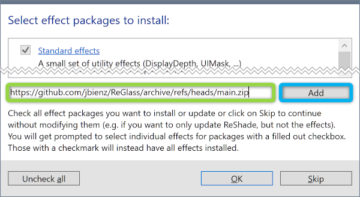
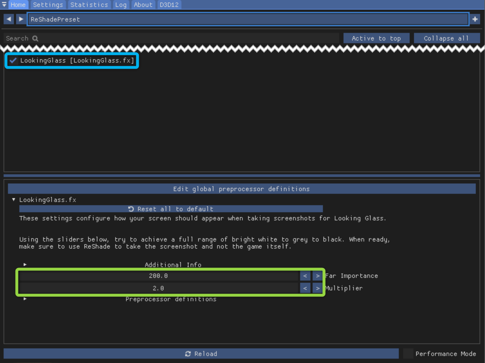

# ReGlass
ReGlass is a ReShade FX filter that enables 3D screenshots for LookingGlass Portrait.

## Why ReShade?

There are several reasons why I chose [ReShade](https://reshade.me):

- ReShade works with a *massive* [list of games](https://reshade.me/compatibility), and more than 500 of them support depth.
- ReShade has an incredible community with ~15k members and ~4k active at any given time.
- The community is constantly adding new games, and if an update breaks an existing game it's addressed quickly.
- ReShade is easy to develop for with many public samples.
- It offers an in-game UI that enables users to get exactly the right shot. 

## Automatic Installation
1. Download ReShade from [reshade.me](https://reshade.me)
1. During the ReShade installation, paste in the following URL:

    > `https://github.com/jbienz/ReGlass/releases/download/v1.0/ReGlass.zip`
1. Click the 'Add' button to add the archive, then click OK to finish the installation.

## Manual Installation
1. Install ReShade from [reshade.me](https://reshade.me) and enable it for your game.
1. Download the latest [ReGlass Archive](https://github.com/jbienz/ReGlass/releases/download/v1.0/ReGlass.zip).
1. Go to the same folder as your games main executable.
1. Go into the sub-folder `reshade-shaders`.
1. Extract the `Shaders` folder from the zip file into the games `reshade-shaders` folder, merging with the `Shaders` folder that already exists.

## Usage
Once installed, launch the game and press 'Home' on your keyboard to bring up the ReShade menu.

Check the box next to LookinGlass, then use the sliders to achieve the desired depth:

- For wide open shots like skylines: Use large values for **Far Importance** (800+) and small values for **Multiplier** (1-2).
- For narrow shots like selfies: Use very small values for **Far Importance** (0.1 - 0.5) and large values for **Multiplier** (50-200).