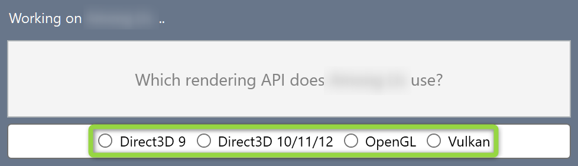
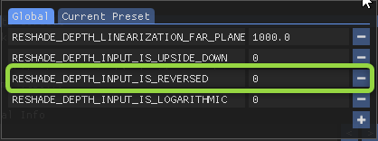
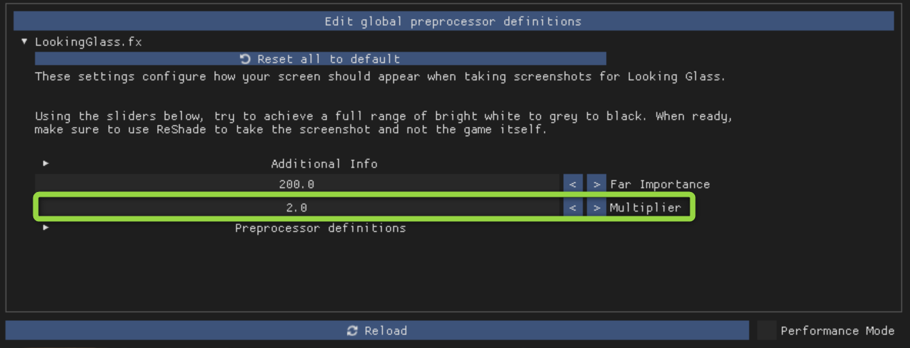

# Find Game Settings
If you've already checked the [Game Settings](GameSettings.md) page and the [Game Settings Discussion][GameSettingsDisc] but the game you want to play isn't listed, fear not! This page will help you determine the right settings for your game. Once you find them, please don't forget to share them in the [Game Settings Discussion][GameSettingsDisc]!

## Compatibility
Before digging into settings it's best to verify that ReShade is compatible with your game. For that, visit the [ReShade Compatibility List][ReShadeCompat] and see if you can find your game. Note that this list isn't updated often, so if your game isn't listed it might still work. But if your game is in the list and there are depth issues, it may not be compatible with ReGlass.

Here are some of the common depth issues and what to expect from them. "Counted" vs "Not Counted" indicates whether I included games with each issue in the "500+ supported games".

- **No depth buffer access -** Everything will appear flat and in the background. (Not Counted)
- **Depth buffer is empty -** Same as above. (Not Counted)
- **Depth buffer only shows XYZ (e.g. hands) -** Only XYZ will "pop out". Everything else will be flat and in the background. (Not Counted)
- **Depth buffer is flipped -** No problem. Just configure ReShade accordingly. (Counted)
- **Game uses a logarithmic depth buffer -** No problem. Just configure ReShade accordingly. (Counted)
- **Use game in offline mode -** ReShade disables depth in multiplayer because bots can use it for cheating. Offline supported. (Counted)
- **Partial depth buffer access -** Unclear but depends on the game. Might be like the hands example above. Might not work at all. (Not Counted)
- **Depth buffer flickers -** Will probably work, but you may have to take several screenshots before you get one with depth. (Counted)
- **XYZ (e.g. trees) missing from depth buffer -** Everything BUT XYZ will look OK. XYZ will appear flat and in the background. (Not Counted)
- **Depth buffer access only in menu** - May or may not work depending on where the menu is displayed. When the shader is enabled only the center 50% of the screen is displayed. If the menu is on the left or right side, you might be OK. If it's in the middle of the screen, it'll be in the way. (Not Counted)  

## API
Now that you've verified your game is compatible, it's time to install ReGlass. 

**API** selection happens during the ReShade installation for your game. Sometimes ReShade already knows the API and won't ask for this. If it does, just search the web to find out which Graphics API the game uses. 

## Main Settings
Now that ReGlass is installed, launch the game and press the 'Home' button on your keyboard to bring up the ReShade menu.

Refer back to the home page for information on the [Depth Settings](index.md#depth-settings) and [Blur Settings](index.md#blur-settings). These settings should mostly work the same across all games.  

## Troubleshooting

Here are some of the most common issues:

### Depth is always black or is inverted

Press the 'Edit global preprocessor definitions' button.

Change `RESHADE_DEPTH_INPUT_IS_REVERSED` from 0 to 1 or from 1 to 0

Then click somewhere else to leave the popup.

### Depth is always white

#### Multiplier issues

Some games work best with a Multiplier of 1.0 or less. Other games, like Half-Life 2, only work with a multiplier of *exactly* 1.0.

#### MSAA

Multisample anti-aliasing (MSAA) is known to cause problems with ReShade depth. If your game supports MSAA, try turning it off.

#### Depth buffer clearing

Some games, like Half-Life 2, clear the depth buffer each time they clear the frame. ReShade offers a setting to make a full copy of the depth buffer before the frame is cleared. You can find this setting on the the last tab in ReShade. It's the tab with the name of the graphics API used by the game (e.g. **D3D9**, **D3D11**).

### Depth works in single player or campaign but not in online multiplayer

ReShade intentionally disables depth buffer access for online play. This is to keep bots from using the depth buffer to cheat. Unfortunately, ReGlass will only work in offline mode for these games.

### Other issues

When troubleshooting it can be helpful to turn OFF the **LookingGlass** shader and turn ON the **DisplayDepth** shader. Just keep in mind that by default ReShade depth is inverted compared to Looking Glass (black is close and white is far).

For additional help I recommend watching the [ReShade Depth Tutorial](https://www.youtube.com/watch?v=52KZrMOo4Y8) by Daemon White. Also, the [Depth Buffer Guide](https://github.com/martymcmodding/ReShade-Guide/wiki/The-Depth-Buffer) by martymcmodding is quite helpful. 

[GameSettingsDisc]: https://github.com/jbienz/ReGlass/discussions/2 "Games Setting Discussion"
[ReShadeCompat]: https://reshade.me/compatibility "ReShade Compatibility List"