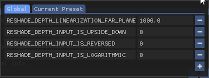

# Game Settings
This page includes the settings necessary to get ReGlass working with various games. 

Is your game not listed? Check the [Game Settings Discussion][GameSettingsDisc] or the [Find Settings](FindSettings.md) page to learn how to find them.

## Games

<table>
  <colgroup>
    <col>
    <col>
	<col style="background-color:#737373">
	<col style="background-color:#6e000f">
	<col style="background-color:#006e1a">
	<col style="background-color:#02006e">
	<col style="background-color:#006e66">
	<col style="background-color:#00616e">
  </colgroup>
  <tr>
    <th>Game</th>
    <th width="12%">API</th>
	<th width="12%">Copy Before Clear</th>
	<th width="12%">Upside Down</th>
	<th width="12%">Reversed</th>
	<th width="12%">Logarithmic</th>
	<th width="12%">Far Importance</th>
	<th width="12%">Multiplier</th>
  </tr>
  <tr>
	<td rowspan="2">Cyberpunk 2077</td>
	<td>D3D12</td>
	<td>Off</td>
	<td>0</td>
	<td>1</td>
	<td>0</td>
	<td>0.2 - 1000</td>
	<td>0.1 - 200</td>
  </tr>
  <tr>
    <td colspan="7"><b>Skylines:</b> Far Importance 800+, Multiplier 1 - 2. <b>Close-ups:</b> Far Importance 0.2 - 0.5, Multiplier 50 - 200.</td>
  </tr>
  <tr>
	<td rowspan="2">DOTA 2</td>
	<td>D3D10/11/12</td>
	<td>On</td>
	<td>0</td>
	<td>0</td>
	<td>0</td>
	<td>100 - 1000</td>
	<td>1.0</td>
  </tr>
  <tr>
    <td colspan="7">Multiplier must be exactly 1.0 Far importance of 200 generally works well.</td>
  </tr>
  <tr>
	<td rowspan="2">Half-Life 2</td>
	<td>D3D9</td>
	<td>On</td>
	<td>0</td>
	<td>0</td>
	<td>0</td>
	<td>1.0 - 350</td>
	<td><b>1.0</b></td>
  </tr>
  <tr>
    <td colspan="7">Multiplier must be <i>exactly</i> <b>1.0</b> or the depth will always be white. Because of this, HL2 has somewhat limited dynamic range. You'll need to compensate for this in HoloPlay or Refract with depthiness.</td>
  </tr>
  <tr>
	<td rowspan="2">Halo Master Chief Collection</td>
	<td>D3D11</td>
	<td>Off</td>
	<td>0</td>
	<td>1</td>
	<td>0</td>
	<td>0.2 - 400</td>
	<td>0.5 - 100</td>
  </tr>
  <tr>
    <td colspan="7">Start the game with mods enabled and play in offline mode.</td>
  </tr>
  <tr>
	<td rowspan="2">Portal 2</td>
	<td>D3D9</td>
	<td>On</td>
	<td>0</td>
	<td>0</td>
	<td>0</td>
	<td>2.0 - 4.5</td>
	<td><b>1.0</b></td>
  </tr>
  <tr>
    <td colspan="7">Be sure to enable Multiplier must be <i>exactly</i> <b>1.0</b> or the depth will always be white. Far Importance is also limited in range. You'll need to compensate for this in HoloPlay or Refract with depthiness.</td>
  </tr>
</table>

## API
**API** is selected during ReShade installation for the game. ReShade won't always ask for this so if you don't see it during installation you can ignore this column.

## Copy Before Clear

**Copy Before Clear** is now set on the **Addons** tab in ReShade rather than the engine tab (which no longer exists).

## Upside Down, Reversed, Logarithmic
To change **Upside Down**, **Reversed** or **Logarithmic**, click *Edit global preprocessor definitions*,

then use the popup to set these values.

[GameSettingsDisc]: https://github.com/jbienz/ReGlass/discussions/2 "Games Setting Discussion"
