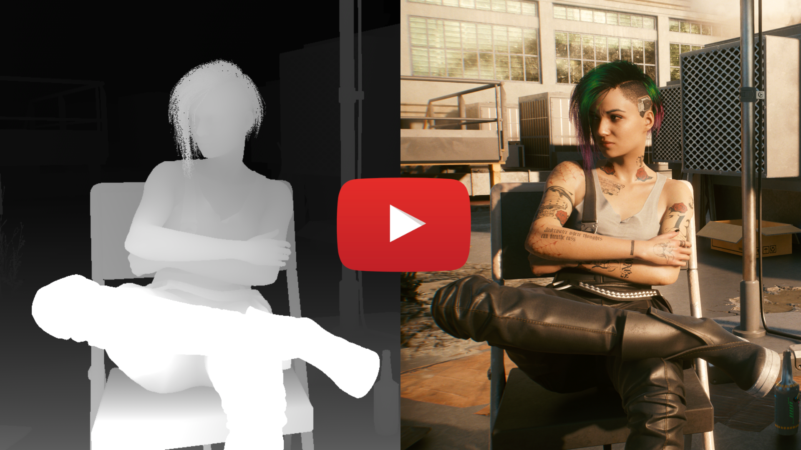
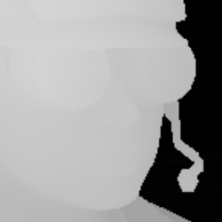

# ReGlass
ReGlass is a 3D screenshot and video capture tool for [Looking Glass Portrait](https://lookingglassfactory.com/portrait). It works with more than 500 games.

[Watch the video](https://youtu.be/YKgHC-UgFOY)

# How does it work?
ReGlass draws the game with color on one side and depth on the other. If a screenshot is taken or a video captured, it can be imported into [HoloPlay Studio](https://docs.lookingglassfactory.com/3d-viewers/holoplay-studio) as a [RGB-D Photo or Video](https://docs.lookingglassfactory.com/3d-viewers/holoplay-studio/rgbd-photo-video). 

**NOTE:** When taking screenshots or capturing video, don't use screenshot or capture facilities built into the game. This is because the game isn't aware of ReShade and won't include the depth information. Instead, use the screenshot feature in ReShade (usually PrintScreen) or external tools like the Windows Game Bar (Win + G) or NVIDIA Overlay (Alt + Z).

## Why ReShade?
There are several reasons why [ReShade](https://reshade.me) was chosen:

- ReShade works with a *massive* [list of games](https://reshade.me/compatibility), and more than 500 of them support depth.
- ReShade has an incredible community with ~15k members and ~4k active at any given time.
- The community is constantly adding new games, and if an update breaks an existing game it's addressed quickly.
- ReShade is easy to develop on with many public samples.
- It offers an in-game UI that enables users to get exactly the right shot. 

## Automatic Installation
1. Download ReShade from [reshade.me](https://reshade.me).
1. During the ReShade installation, paste in the following URL:

    > `https://github.com/jbienz/ReGlass/releases/download/v1.1/ReGlass.zip`
1. Click the 'Add' button to add the archive, then click OK to finish the installation.

## Manual Installation
1. Install ReShade from [reshade.me](https://reshade.me) and enable it for your game.
1. Download the latest [ReGlass Archive](https://github.com/jbienz/ReGlass/releases/download/v1.1/ReGlass.zip).
1. Go to the same folder as your games main executable.
1. Go into the sub-folder `reshade-shaders`.
1. Extract the `Shaders` folder from the zip file into the games `reshade-shaders` folder, merging with the `Shaders` folder that already exists.

## Usage

### Depth Settings
Once installed, launch the game and press 'Home' on your keyboard to bring up the ReShade menu.

Check the box next to LookingGlass, then use the sliders to achieve the desired depth:

- **Wide open shots like skylines:** Use large values for **Far Importance** (800+) and small values for **Multiplier** (1-2).
- **Narrow shots like selfies:** Use very small values for **Far Importance** (0.1 - 0.5) and large values for **Multiplier** (50-200).

### Blur Settings
The blur settings can be used to "smooth out" sharp differences in the depth map.

There are three sliders that can be used to adjust the blur, but the defaults should work well for most screenshots.

#### Why blur the depth map at all?
The primary reason is to make life easier for HoloPlay Studio when recreating the scene.

In CyberPunk 2077, for example, the depth map often has holes and pixelation in areas like hair:

These wreak havoc when HoloPlay tries to recreate the 3D surface for the hair. Blurring the depth map fills in holes and smoothes out the pixelation.

It's also common in games for a subject to be close to the camera when the background is far away:

This again is *very* difficult for HoloPlay Studio. The sharp contrast between things that are close and things that are far causes tearing in the image. This tearing is especially visible when you view the scene from the sides. Blurring the depth map "rounds off" these sharp edges and creates a smooth transition from close to far.  

Smooth transition means far less tearing.

## How do I make it work with XYZ game?
First, start with the [Game Settings](GameSettings.md) page to see if your game is already listed. Next, check the [Game Settings Discussion][GameSettingsDisc] thread. Finally, see the [Find Settings](FindSettings.md) page to learn how to configure ReGlass for a new game.

## Thanks
Special thanks to Ioxa and Otakumouse for their [GaussianBlur shader](https://github.com/Otakumouse/stormshade/blob/master/v4.X/reshade-shaders/Shader%20Library/Recommended/GaussianBlur.fx), which was modified and embedded in this shader to enable blurring the depth map.

## Questions?
I'm not always online, but my user name is **eXntrc** on the [Looking Glass Discord](https://discord.com/invite/lookingglassfactory).

[GameSettingsDisc]: https://github.com/jbienz/ReGlass/discussions/2 "Games Setting Discussion"
